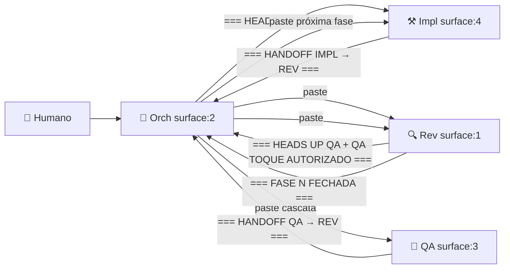

# Multi-Agent Dev Workflow

Coordena 4 instâncias **Claude Code** rodando simultaneamente em panes [cmux](https://github.com/manaflow-ai/cmux) Mac. Cada agente tem papel fixo, marcadores canônicos, e prompt inicial reutilizável. Bootstrap em ~5min.

## Quando usar esta skill

- Projeto novo com escopo grande (>5 fases planejadas)
- Sprint formal com critério de aceite por fase
- Integração externa complexa (marketplace, payment provider, fiscal)
- Qualquer trabalho que ganha com **revisão arquitetural independente** do código

## Quando NÃO usar

- Fix mecânico de 1 linha (overhead não vale)
- Spike de exploração (não tem entrega definida)
- Refactor cosmético (não tem critério de aceite)
- Projeto com 1 dev solo + sem necessidade de gating

## Fluxo



## Como invocar

### 1. Bootstrap de projeto novo

```bash
# Spawnar workspace cmux + 4 panes + Claude Code em cada com prompts certos
bash ~/.claude/skills/multi-agent-dev-workflow/scripts/bootstrap.sh <project-path>
```

### 2. Setup memórias persistentes do projeto

```bash
# Copia 17 memórias agnósticas + cria MEMORY.md index
bash ~/.claude/skills/multi-agent-dev-workflow/scripts/setup-memories.sh <project-name>
```

### 3. Prompts iniciais (copiar manualmente em cada Claude Code)

Cada agente cola o prompt agnóstico correspondente como **primeira mensagem** do Claude Code:

| Agente | Prompt | Surface mapping default |
|---|---|---|
| Orchestrator | `~/.claude/skills/multi-agent-dev-workflow/prompts/orchestrator.md` | surface:2 |
| Implementador | `~/.claude/skills/multi-agent-dev-workflow/prompts/implementador.md` | surface:4 |
| Revisor | `~/.claude/skills/multi-agent-dev-workflow/prompts/revisor.md` | surface:1 |
| QA | `~/.claude/skills/multi-agent-dev-workflow/prompts/qa.md` | surface:3 |

**Ajuste surface mapping antes** se seu workspace cmux tem layout diferente (rode `cmux list-pane-surfaces --workspace <ws>`).

## Pré-requisitos não-negociáveis

### 3 docs base no repo do projeto

| Doc | Função | Sem ele... |
|---|---|---|
| `ARCHITECTURE.md` (ou PRD/DESIGN.md) | Fonte da verdade técnica — schema, endpoints, decisões | Rev sem referência → vira opinião sem âncora |
| `IMPLEMENTATION_ORDER.md` (ou ROADMAP.md) | Ordem das sprints + escopo + critério aceite | Impl não sabe o que implementar agora → fluxo congela |
| `CLAUDE.md` (ou CONTRIBUTING.md) | Convenções do repo — linguagem, framework, naming, tools proibidas | Impl usa ORM quando deveria query builder → dívida vira lei |

`docs/adr/NNN-*.md` acumulativos nascem do trabalho (Rev cobra alinhamento + Impl cravar nas decisões duradouras).

### Ferramentas

- **cmux** instalado e workspace criado: [manaflow-ai/cmux](https://github.com/manaflow-ai/cmux)
- **Claude Code CLI** funcional
- **Git** com remote configurado pro projeto
- **Pre-commit hook** ativo (`.githooks/pre-commit` + `make setup-hooks` no projeto)

### Cmux surface mapping

Padrão sugerido (pode ajustar):

| Surface | Agente |
|---|---|
| `surface:1` | Revisor |
| `surface:2` | Orchestrator |
| `surface:3` | QA |
| `surface:4` | Implementador |

Cravar no projeto via memory `orchestrator-surface-mapping.md` (template em `memories/`).

## Marcadores canônicos (fluxo)

Cada agente fecha turno com frase canônica na **última linha** do output. Orch detecta via `cmux read-screen --scrollback | grep -E "<marker>"`.

| Origem | Marker | Destino |
|---|---|---|
| Impl | `=== HANDOFF IMPLEMENTADOR → REVISOR ===` | Rev |
| Impl | `=== HANDOFF IMPLEMENTADOR → REVISOR SPIKE ===` | Rev (spike timeboxed) |
| Impl | `=== HANDOFF IMPLEMENTADOR → REVISOR FIX SMOKE ===` | Rev (fix pós-smoke) |
| Rev | `=== HEADS UP QA + QA TOQUE AUTORIZADO ===` | QA |
| Rev | `=== FIX APROVADO + RE-CASCATA QA AUTORIZADA ===` | QA |
| Rev | `=== BUG ENCONTRADO PELO REV ===` | Impl |
| Rev | `=== FASE N 100% FECHADA + LIBERADO FASE N+1 ===` | Impl (próxima fase) |
| QA | `=== HANDOFF QA → REVISOR ===` | Rev (cascata passou) |
| QA | `=== BUG ENCONTRADO PELO QA ===` | Impl (cascata falhou) |

## Estrutura de docs por fase

Cada fase produz 3 handoff docs em `docs/handoff/sprint-N/fase-N/`:

```
sprint-N/fase-N/
├── 01-implementador-handoff-revisor.md       # Impl entrega
├── 02-revisor-aprovado.md                    # Rev valida + checklist QA inline + descritivo Fase N+1 pré-preparado
└── 03-qa-aprovado-handoff-revisor.md         # QA valida (OR 03-qa-bug-encontrado-handoff-impl.md se falhou)
```

Templates em `~/.claude/skills/multi-agent-dev-workflow/templates/`.

## Memórias persistentes

A skill traz **17 memórias agnósticas** em `memories/` que cravam protocolos descobertos durante uso real (cada uma nasceu de incidente concreto). Setup-memories.sh copia tudo pro projeto.

Categorias:
- **Comunicação** (paste-enter, auto-forward, yes-while-away, wake-times)
- **Gating** (fases-sequenciais, compact-vs-clear, session-size-watchdog)
- **Permissões** (qa-tools-preauthorized, handoff-folder-read-access)
- **Práticas** (spec-research-first, smoke-replay-handlers, smoke-visual-ask-luccas, revisor-handoff-qa)
- **Boundaries** (qa-code-touches, qa-workflow-cascata-enxuta, secrets-protection)
- **Reference** (workflow-orchestrator-markers, orchestrator-operation-mode)

## Limitações conhecidas

- **Mac-only** (cmux é Mac). Linux/Windows precisariam de tmux + adaptações.
- **Context window crash** >300k tokens por pane — memory `feedback-session-size-watchdog` cravar protocolo `/compact`.
- **Paste cross-pane fragmenta** com newlines — orch usa 1-linha + 3 Enters em rajada.
- **Orch só age via wake** — não event-driven. `ScheduleWakeup` cadência adaptada.

## Referência completa

Documento agnóstico completo (852 linhas): [Multi-Agent Workflow](https://luccchagas.github.io/) (versão GitHub Pages).

OR localmente no projeto BistroOps: `docs/workflow/multi-agent-workflow.md`.

## Versionamento

- v2 (2026-06-08): Refator completo pós-Sprint 6.5 BistroOps. Orchestrator + cmux + 17 memórias canônicas + templates.
- v1 (2026-03-30): SKILL.legacy-30mar2026.md — conceitos iniciais 4 panes manuais (iTerm2, sem orch, sem marcadores).
